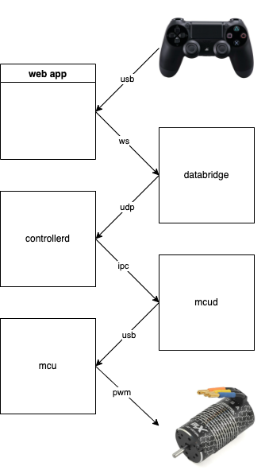

The goal is to control rc car remotely over lte network and stream video back in real time.

Its like a videogame but irl.

Imagine shredding new york city streets in a 1/8 scale that goes 40+ mph. doordash people stop buying electric bikes do the deliveries w small rover.

### Overview

Camera is a comma.ai style andrioid phone with front/back image sensor. The MCU is a simple arduino nano that controls brushelss motor via BLX100 ESC and a steering servo.

### controls flow

### video flow
