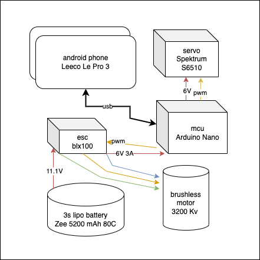

# mcu

Steering and throttle control from arduino.

The goal of this microntroller is to keep things simple - just receive serial commands, perform safety checks, and execute controls.

### hardware

